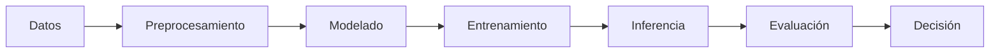

# MA2014 - Métodos de Razonamiento e Incertidumbre


## 📖 Descripción

Este repositorio contiene el material del curso **MA2014 - Métodos de Razonamiento e Incertidumbre**, enfocado en modelos probabilísticos y técnicas de machine learning para el razonamiento bajo incertidumbre. El curso cubre desde clasificadores básicos hasta modelos secuenciales y sistemas de toma de decisiones.

---

## 📁 Estructura del Repositorio

```
MA2014/
├── Módulo I/
│   ├── Naive Bayes Classifier.ipynb
│   └── spam.csv
├── Módulo II/
│   ├── Bayesian Networks.ipynb
│   ├── Solution Template.ipynb
│   └── diabetes-dataset.csv
├── Módulo III/
│   ├── Hidden Markov Models.ipynb
│   └── Solution Template.ipynb
├── Módulo IV/
│   ├── Solution Template.ipynb
│   └── diabetes-dataset.csv
└── README.md
```

---

## 📚 Contenido por Módulo

### 🔹 Módulo I: Clasificador Naive Bayes

**Tema:** Implementación y Evaluación de un Clasificador Naive Bayes para la Detección Automática de Correos Electrónicos SPAM

#### Conceptos Cubiertos:
- **Teorema de Bayes** - Fundamento matemático del clasificador
- **Probabilidad Condicional** - $P(A|B) = \frac{P(B|A)P(A)}{P(B)}$
- **Supuesto de Independencia Naive** - Independencia condicional entre características
- **Procesamiento de Lenguaje Natural (NLP)**:
  - Tokenización
  - Eliminación de stopwords
  - Stemming y Lemmatización
- **Modelo Bag of Words** - Representación de documentos por frecuencia de palabras
- **N-gramas (Bi-gramas)** - Captura de secuencias de palabras

#### Métricas de Evaluación:
| Métrica | Fórmula |
|---------|---------|
| **Accuracy** | $\frac{TP + TN}{TP + FP + TN + FN}$ |
| **Precision** | $\frac{TP}{TP + FP}$ |
| **Recall** | $\frac{TP}{TP + FN}$ |
| **F1 Score** | $2 \cdot \frac{Precision \cdot Recall}{Precision + Recall}$ |

#### Dataset:
- **UCI ML SMS Spam Collection** (~5,500 mensajes)
- Variables: Texto del email, Etiqueta (spam/ham)

#### Librerías Utilizadas:
```python
pandas, numpy, nltk, re
```

---

### 🔹 Módulo II: Redes Bayesianas

**Tema:** Implementación de Redes Bayesianas para modelar dependencias probabilísticas

#### Conceptos Cubiertos:
- **Redes Bayesianas (Bayesian Belief Networks)** - Grafos dirigidos acíclicos (DAGs)
- **Tablas de Probabilidad Condicional (CPT)** - $P(X|Pa(X))$
- **Inferencia Probabilística** - Actualización de creencias con evidencia
- **Problema de Monty Hall** - Ejemplo clásico de inferencia bayesiana

#### Estructura de una Red Bayesiana:
```
Nodos → Variables aleatorias
Aristas → Dependencias probabilísticas
CPTs → Probabilidades condicionales
```

#### Proyecto: Diagnóstico de Diabetes
- **Objetivo:** Predecir probabilidad de diabetes dado factores de salud
- **Variables:** Pregnancies, Glucose, BloodPressure, SkinThickness, Insulin, BMI, Age, Outcome
- **Discretización:** Por cuartiles (Q1, Q2, Q3, Q4) → valores {0, 1, 2, 3}

#### Librerías Utilizadas:
```python
pybbn, networkx, matplotlib, pandas
```

---

### 🔹 Módulo III: Modelos Ocultos de Markov (HMM)

**Tema:** Hidden Markov Models para inferencia en secuencias temporales

#### Conceptos Cubiertos:
- **Cadenas de Markov** - Propiedad de Markov (memoryless)
- **Modelos Ocultos de Markov** - Estados ocultos + observaciones
- **Matriz de Transición** - $T_{ij} = P(X_k = s_j | X_{k-1} = s_i)$
- **Matrices de Observación** - $O_{j,ii} = P(E_k = e_j | X_k = s_i)$

#### Algoritmos de Inferencia:

| Algoritmo | Objetivo | Fórmula |
|-----------|----------|---------|
| **Filtering** | $P(X_k \| E_{1:k})$ | $f_{1:k+1} = \alpha \cdot O[k+1] \cdot T^T \cdot f_{0:k}$ |
| **Prediction** | $P(X_{k+j} \| E_{1:k})$ | $(T^T)^j \cdot filtering(E)$ |
| **Smoothing** | $P(X_j \| E_{1:k})$ para $j < k$ | $forward \cdot backward$ |
| **Viterbi** | Secuencia más probable | $\max_{x_{1:k}} P(x_{1:k} \| E_{1:k})$ |

#### Ejemplo: Problema del Paraguas
- **Estados ocultos:** Rain, No Rain
- **Observaciones:** Umbrella, No Umbrella
- **Objetivo:** Inferir el clima dado las observaciones

#### Proyecto: Localización de Robot
- **Escenario:** Robot en una cuadrícula con obstáculos
- **Sensores:** 4 direcciones (N, E, W, S) con tasa de error $\epsilon$
- **Objetivo:** Inferir posición del robot mediante filtering/smoothing/Viterbi
- **Visualización:** Heatmaps de probabilidad

#### Librerías Utilizadas:
```python
numpy, numpy.linalg
```

---

### 🔹 Módulo IV: Teoría de la Decisión y Diagramas de Influencia

**Tema:** Extensión de Redes Bayesianas con nodos de decisión y utilidad

#### Conceptos Cubiertos:
- **Diagramas de Influencia** - Redes Bayesianas + decisiones + utilidades
- **Función de Utilidad** - $U(estado, acción)$
- **Utilidad Esperada** - $EU(a) = \sum_s P(s|E) \cdot U(s, a)$
- **Principio de Máxima Utilidad Esperada (MEU)** - $a^* = \arg\max_a EU(a)$

#### Estructura del Diagrama de Influencia:
```
┌──────────────────────────────────────────────────────┐
│  Nodos de Azar (Círculos) → Variables aleatorias     │
│  Nodos de Decisión (Rectángulos) → Acciones          │
│  Nodos de Utilidad (Diamantes) → Valores de utilidad │
└──────────────────────────────────────────────────────┘
```

#### Proyecto: Recomendación de Dieta
- **Decisión:** Elegir alimento según índice glucémico (GI)
  - Low GI (< 55)
  - Medium GI (55-69)
  - High GI (≥ 70)
- **Estados:** Diabético (1) / No Diabético (0)

**Tabla de Utilidad:**

| Estado \ Acción | Low GI | Medium GI | High GI |
|-----------------|--------|-----------|---------|
| No Diabético (0) | 60 | 100 | 80 |
| Diabético (1) | 100 | 50 | 0 |

**Resultados Esperados:**
- No diabético (P=1.0) → **Medium GI** (U=100)
- Diabético (P=1.0) → **Low GI** (U=100)
- Incierto (P=0.5) → **Low GI** (EU=80)

#### Librerías Utilizadas:
```python
pybbn, networkx, matplotlib, pandas, numpy
```

---

## 🛠️ Instalación

### Requisitos Previos
```bash
pip install pandas numpy matplotlib networkx nltk pybbn
```

### Descargar recursos de NLTK
```python
import nltk
nltk.download('stopwords')
nltk.download('punkt')
nltk.download('punkt_tab')
nltk.download('wordnet')
```

---

## 📊 Datasets Utilizados

| Dataset | Módulo | Descripción | Fuente |
|---------|--------|-------------|--------|
| `spam.csv` | I | SMS Spam Collection (~5,500 mensajes) | [UCI ML Repository](https://www.kaggle.com/uciml/sms-spam-collection-dataset) |
| `diabetes-dataset.csv` | II, IV | Variables de salud para predicción de diabetes | [Kaggle](https://www.kaggle.com/vikasukani/diabetes-data-set) |

---

## 🧮 Fórmulas Matemáticas Clave

### Teorema de Bayes
$$P(A|B) = \frac{P(B|A) \cdot P(A)}{P(B)}$$

### Clasificador Naive Bayes
$$P(spam|w_1, w_2, ..., w_n) = \frac{\prod_{i=1}^{n} P(w_i|spam) \cdot P(spam)}{P(w_1, w_2, ..., w_n)}$$

### Suavizado de Laplace
$$P(w|clase) = \frac{count(w) + \alpha}{total\_words + \alpha \cdot vocab\_size}$$

### Filtering (HMM)
$$f_{1:k+1} = \alpha \cdot O[k+1] \cdot T^T \cdot f_{0:k}$$

### Smoothing (HMM)
$$P(X_j|E_{1:k}) \propto f_{1:j} \cdot b_{j+1:k}$$

### Utilidad Esperada
$$EU(a) = \sum_{s \in S} P(s|E) \cdot U(s, a)$$

---

## 📈 Flujo de Trabajo Típico



---

## 📝 Referencias

- **Naive Bayes:** [NLTK Documentation](https://www.nltk.org/)
- **Redes Bayesianas:** [PyBBN Documentation](https://py-bbn.readthedocs.io/)
- **HMM:** Russell, S. & Norvig, P. - *Artificial Intelligence: A Modern Approach*
- **Teoría de la Decisión:** Mohammadi et al. (2015) - *Using Bayesian Network for the Prediction and Diagnosis of Diabetes*

---

## 👤 Autor

**Ricardo B.**  
Instituto Tecnológico y de Estudios Superiores de Monterrey  
Ciencia de Datos

---

## 📄 Licencia

Este proyecto está bajo la licencia MIT. Ver el archivo [LICENSE](LICENSE) para más detalles.
